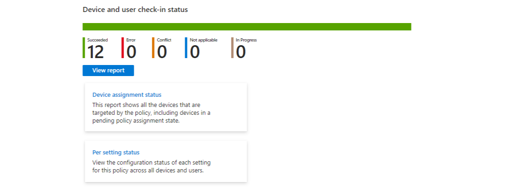
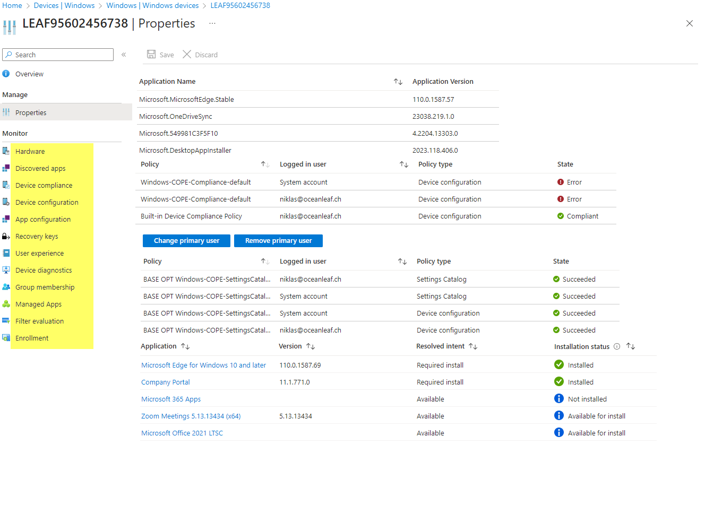

# Troubleshooting Config Profiles

Most content taken from [Niklas Tinner](https://www.oceanleaf.ch/troubleshooting-intune-policies-and-apps/)

### Intune Portal
Ways to check and troubleshoot

1. **From the Content Perspective**  
   This involves checking status from a profile, app, and similar content areas. Here, you can find:
   - **Device Assignment Status**
   - **User Assignment Status**
   - **Per Settings Status**

   Example of "Per Settings Status":  
   

   > **Note:** Be sure to verify the check-in time to confirm if changes have been applied to the device.

2. **From the Device Perspective**  
   This section allows you to see all content applied to a specific device.  
   Example:  
   

3. **Troubleshooting + Support**  
   A section where you can search by a username and see all associated information.  
   

### Diagnostics and MDMDiagnostics

- **MDMDiagnostics Tool**  
  A great way to see specific settings and determine if they have been applied successfully.  
  **Command to run:**  
  ```cmd
  MDMDiagnosticsTool.exe -out c:\temp

### Collect Diagnostics from Intune

From a device selected in Intune, you can choose the **"Collect Diagnostics"** option to gather a comprehensive report. The downloaded report includes the following details:

- **Registry**  
- **Commands and Outputs**  
- **Event Viewer**  
- **Files**  

### IntuneManagementExtension Log

The IntuneManagementExtension log is the primary location for identifying app installation failures and PowerShell deployment script issues. 

> **Tip:** Use **CMTrace** to read these logs effectively. Without it, reading and understanding logs sucks A

### Event Viewer

For detailed error and configuration information, you can check the Event Viewer logs under the following path:  
`Applications and Services Logs>Microsoft>Windows>DeviceManagement-Enterprise-Diagnostics-Provider`

## 4. Registry

The most relevant registry paths to examine include:

- **DeviceManagement-Enterprise-Diagnostics-Provider**  
- **ModernDeployment-Diagnostics-Provider**  
- **Provisioning-Diagnostics-Provider**  
- **AAD-Operational**  

These can be found in:
`Applications and Services Logs > Microsoft > Windows`

